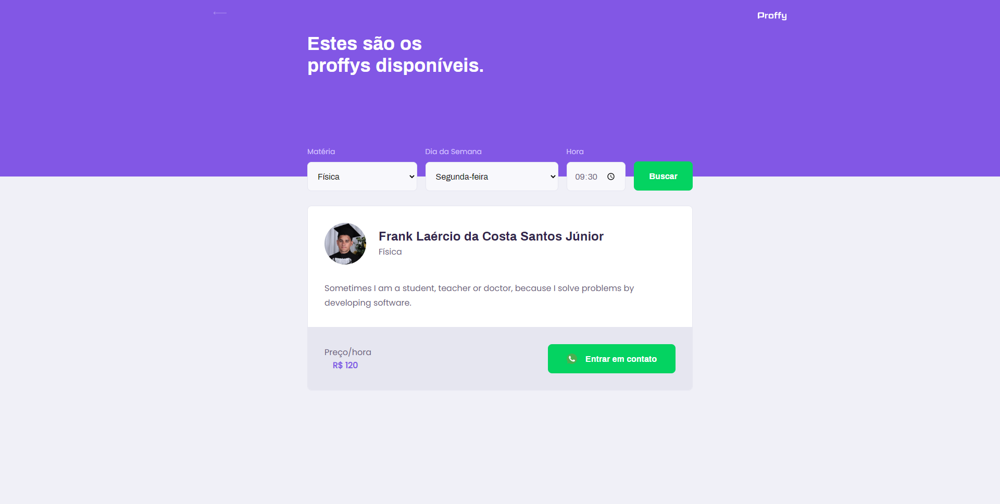

<h2 align="center"> 
  :books: Proffy
</h1>

  
  
  
  
  
  
  

  
   

## :bookmark_tabs: Resume of application

This project is a tool for create connections by education classes. In this is possible find teachers and create your personal profile for learning subject. The project was created in the Next Level Week 2.0 (Rocketseat).

  
  

  

  

## :mag_right: Getting Started

Under development

## :family: Contributing

Please read [CONTRIBUTING.md](https://gist.github.com/PurpleBooth/b24679402957c63ec426) for details on our code of conduct, and the process for submitting pull requests to us.

## :chart_with_upwards_trend: Versioning

For the versions available, see the [tags on this repository](https://github.com/franklaercio/Ecoleta/tags). 

## :man_technologist: Authors

* **Frank Laércio** - [franklaercio](https://github.com/franklaercio)

See also the list of [contributors](https://github.com/franklaercio/Ecoleta/contributors) who participated in this project.

## :clipboard: License

This project is licensed under the MIT License - see the [LICENSE.md](LICENSE.md) file for details

## :newspaper: Acknowledgments

React
React Native
Node.js
